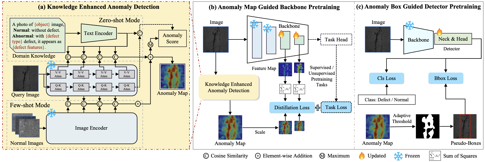

# AGSSP
Official PyTorch Implementation of [Advancing Metallic Surface Defect Detection via Anomaly-Guided Pretraining on a Large Industrial Dataset](#)

Pretrained models are commonly employed to improve finetuning performance in metallic surface defect detection, especially in data-scarce environments. However, models pretrained on ImageNet often underperform due to data distribution gaps and misaligned training objectives. To address this, we propose a novel method called Anomaly-Guided Self-Supervised Pretraining (AGSSP), which pretrains on a large industrial dataset containing 120,000 images. AGSSP adopts a two-stage framework: (1) anomaly map guided backbone pretraining, which integrates domain-specific knowledge into feature learning through anomaly maps, and (2) anomaly box guided detector pretraining, where pseudo-defect boxes derived from anomaly maps act as targets to guide detector training. Anomaly maps are generated using a knowledge enhanced anomaly detection method. Additionally, we present two small-scale, pixel-level labeled metallic surface defect datasets for validation. Extensive experiments demonstrate that AGSSP consistently enhances performance across various settings, achieving up to a 10\% improvement in mAP@0.5 and 11.4% in mAP@0.5:0.95 compared to ImageNet-based models.




## Data Download

Casting Billet and Steel Pipe datasets can be downloaded from https://github.com/clovermini/MVIT_metal_datasets.

## Environments
```bash
# Our code is based on mmyolo=0.6.0, mmpretrain=1.2.0, mmdet=3.3.0, mmseg=1.2.2.
pip3 install -r requirements.txt
```

## Pre-training and Fine-tuning Instructions
### Pre-training
```bash
# Change the corresponding configuration in configs
sh run_pretrain.sh

# multi gpu
sh dist_run_pretrain.sh
```

### Fine-tuning
```bash
# Change the corresponding configuration in configs
sh run_yolo.sh
```

### Results of different Methods

| Backbone       | Detector | Pretrain Method | Pretrain Dataset | mAP@0.5 | mAP@0.5:0.95 | Pretrain Weight | Config |
|----------------|----------|-----------------|------------------|---------|--------------|-----------------|--------|
| CSPDarket      | YOLO     | cls  | ImageNet         | 71.6    | 33.5         | -               |  -  |
| CSPDarket      | YOLO     | [cls](https://github.com/clovermini/AGSSP/blob/main/configs/pretrain_agbp/yolov8s/yolov8s_1xb256_metal.py)      | Industrial       | 72.8    | 34.7         | -               | - |
| CSPDarket      | YOLO     | [AGBP](https://github.com/clovermini/AGSSP/blob/main/configs/pretrain_agbp/yolov8s/yolov8s_1xb256_metal_distill_multi.py)           | Industrial       | 74.9    | 37.5         | -               | - |
| CSPDarket      | YOLO     | [AGSSP](https://github.com/clovermini/AGSSP/blob/main/configs/pretrain_agdp/yolov8_s_syncbn_fast_1xb32-10e_pretrain_frozen.py)           | Industrial       | 77.2    | 44.9         | [baiduyun](https://pan.baidu.com/s/1665952Q9exabBUbfYkjP6A?pwd=nace) / [google](https://drive.google.com/file/d/1zZSqGy5knrkZrZtcbff7JHOFUtG4-WoD/view?usp=sharing) | [config](https://github.com/clovermini/AGSSP/blob/main/configs/yolo/yolov8_s_syncbn_fast_1xb32-500e_casting_billet_mini_agssp.py) |
| ResNet50       | YOLO     | cls  | ImageNet         | 69.1    | 32.3         | -               | [config](https://github.com/clovermini/AGSSP/blob/main/configs/yolo/yolov8_s_resnet50_1xb32-500e_casting_billet_mini.py) |
| ResNet50       | YOLO     | [cls](https://github.com/clovermini/AGSSP/blob/main/configs/pretrain_agbp/resnet/resnet50_1xb256_metal.py)      | Industrial       | 69.1    | 33.6         | -               | - |
| ResNet50       | YOLO     | [AGBP](https://github.com/clovermini/AGSSP/blob/main/configs/pretrain_agbp/resnet/resnet50_1xb256_metal_distill_multi.py)            | Industrial       | 72.0    | 36.1         | -               | - |
| ResNet50       | YOLO     | [AGSSP](https://github.com/clovermini/AGSSP/blob/main/configs/pretrain_agdp/yolov8_s_resnet50_1xb32-10e_pretrain_frozen.py)           | Industrial       | 74.5    | 42.5         | [baiduyun](https://pan.baidu.com/s/1Uv_Z6SkZl9QJmNhkHSnhtw?pwd=ux5w) / [google](https://drive.google.com/file/d/1LmdjnMikyMbcVy4divOEbHAc0VI_VJz2/view?usp=sharing) | [config](https://github.com/clovermini/AGSSP/blob/main/configs/yolo/yolov8_s_resnet50_1xb32-500e_casting_billet_mini_agssp.py) |
| Swin-Base      | YOLO     | cls  | ImageNet         | 75.7    | 37.7         | -               | [config](https://github.com/clovermini/AGSSP/blob/main/configs/yolo/yolov8_s_swinb_1xb32-500e_casting_billet_mini.py) |
| Swin-Base      | YOLO     | [cls](https://github.com/clovermini/AGSSP/blob/main/configs/pretrain_agbp/swin/swin-base_1xb256_metal.py)      | Industrial       | 73.3    | 36.0         | -               | - |
| Swin-Base      | YOLO     | [AGBP](https://github.com/clovermini/AGSSP/blob/main/configs/pretrain_agbp/swin/swin-base_1xb256_metal_distill_multi.py)            | Industrial       | 76.8    | 39.0         | -               | - |
| Swin-Base      | YOLO     | [AGSSP](https://github.com/clovermini/AGSSP/blob/main/configs/pretrain_agdp/yolov8_s_swinb_1xb32-10e_pretrain_frozen_cls.py)           | Industrial       | 77.7    | 45.0         | [baiduyun](https://pan.baidu.com/s/1nbRCRermuVofwpX9OdkWTA?pwd=w45v) / [google](https://drive.google.com/file/d/1dSRW03lLlbIL7Kz1i_9juMY9kUTPsMhX/view?usp=sharing) | [config](https://github.com/clovermini/AGSSP/blob/main/configs/yolo/yolov8_s_swinb_1xb32-500e_casting_billet_mini_agssd_cls.py) |
| Swin-Base      | YOLO     | SimMIM | ImageNet        | 78.3    | 44.3         | -               | - |
| Swin-Base      | YOLO     | [SimMIM](https://github.com/clovermini/AGSSP/blob/main/configs/pretrain_agbp/simmim/simmim_swin-base-w6_1xb256-amp-coslr-500e_in1k-192px_metal.py)   | Industrial       | 76.5    | 41.5         | -               | - |
| Swin-Base      | YOLO     | [AGBP](https://github.com/clovermini/AGSSP/blob/main/configs/pretrain_agbp/simmim/simmim_swin-base-w6_1xb256-amp-coslr-500e_in1k-192px_metal_distill_multi.py)            | Industrial       | 79.8    | 44.3         | -               | - |
| Swin-Base      | YOLO     | [AGSSP](https://github.com/clovermini/AGSSP/blob/main/configs/pretrain_agdp/yolov8_s_swinb_1xb32-10e_pretrain_frozen.py)           | Industrial       | 78.8    | 48.4         | [baiduyun](https://pan.baidu.com/s/1PBOnVVWiictCoz-BASfyKw?pwd=r6ji) / [google](https://drive.google.com/file/d/1UkH182LFlt07-Ux8Y-Jfk4_1NU7DySH5/view?usp=sharing) | [config](https://github.com/clovermini/AGSSP/blob/main/configs/yolo/yolov8_s_swinb_1xb32-500e_casting_billet_mini_agssd.py) |
| Swin-Base      | Faster R-CNN | SimMIM | ImageNet      | 64.6    | 31.7         | -               | [config](https://github.com/clovermini/AGSSP/blob/main/configs/faster_rcnn/faster-rcnn_swinb_fpn_1x_casting.py) |
| Swin-Base      | Faster R-CNN | AGBP           | Industrial       | 71.1    | 38.6         | -               | [config](https://github.com/clovermini/AGSSP/blob/main/configs/faster_rcnn/faster-rcnn_swinb_fpn_1x_casting_agbp.py) |
| Swin-Base      | Faster R-CNN | [AGSSP](https://github.com/clovermini/AGSSP/blob/main/configs/pretrain_agdp/faster-rcnn_swinb_fpn_1x_pretrain_frozen.py)          | Industrial       | 73.0    | 41.0         | [baiduyun](https://pan.baidu.com/s/1SZ2E2GUjAG6QD9btW_mvAw?pwd=ab8h) / [google](https://drive.google.com/file/d/1RX1J20KA2fM5Y2Q9aZRVxaTXucENR67V/view?usp=sharing) | [config](https://github.com/clovermini/AGSSP/blob/main/configs/faster_rcnn/faster-rcnn_swinb_fpn_1x_casting_agssp.py) |
| Swin-Base      | DINO      | SimMIM | ImageNet        | 78.6    | 49.3         | -               | [config](https://github.com/clovermini/AGSSP/blob/main/configs/dino/dino-4scale_swin-b_1xb8-12e_casting.py) |
| Swin-Base      | DINO      | AGBP           | Industrial       | 79.2    | 49.5         | -               | [config](https://github.com/clovermini/AGSSP/blob/main/configs/dino/dino-4scale_swin-b_1xb8-12e_casting_agbp.py) |
| Swin-Base      | DINO      | [AGSSP](https://github.com/clovermini/AGSSP/blob/main/configs/pretrain_agdp/dino-4scale_swinb_1xb32-10e_pretrain_frozen.py)          | Industrial       | 79.0    | 50.4         | [baidyun](https://pan.baidu.com/s/1c81dxqqlgvTpSZfdhWYAsg?pwd=c89d) / [google](https://drive.google.com/file/d/1zDRs37IAV7jXiiu5DyThOfgQtefK2mOz/view?usp=sharing) | [config](https://github.com/clovermini/AGSSP/blob/main/configs/dino/dino-4scale_swin-b_1xb8-12e_casting_agssp.py) |

## Performance Comparison of Different Backbones and Pretraining Methods


## Citation
If you find our work is useful in your research or applications, please consider giving us a star 🌟 and citing it.
